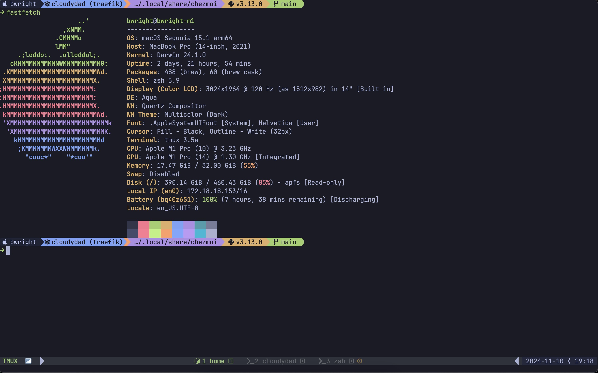

# dotfiles



Setups and configures various dotfiles, installs packages, and configures the
host machine. This repo strives to be as declarative and idempotent as possible
while keeping configurations up-to-date and in sync across many different hosts.

To facilitate these goals, this repo uses [chezmoi](https://www.chezmoi.io/) and
[ansible](https://docs.ansible.com/ansible/latest/getting_started/index.html).

## To Execute

You need to create a chezmoi config file under the XDG Base Directory. For
macOS, that would be: `~/.config/chezmoi/chezmoi.toml` Chezmoi supports
different [file formats](https://www.chezmoi.io/reference/configuration-file/),
but I currently use TOML.

My config file for chezmoi is pretty simple. There are a few unique components
related to GPG encryption support for chezmoi. (NOTE: replace the example email
address with the correct email address used for the GPG keys)

```toml
encryption = "gpg"
pager = "delta"

[edit]
command = "nvim"

[gpg]
symmetric = false
recipient = "me@example.com"

[pinentry]
command = "pinentry"

[data]
system = "personal"
email_work = "me@work.com"
email_personal = "me@personal.com"
ghuser = "wrightbradley"
hwkey = "0xABCDEF1234567XYZ"
```

With this config in place, you can then install chezmoi and use your GitHub
dotfiles repo to bootstrap a new machine:

```bash
# To bootstrap chezmoi and run ansible:
curl -sSL https://raw.githubusercontent.com/wrightbradley/dotfiles/refs/heads/main/ansible/bootstrap.sh | GITHUB_USERNAME=wrightbradley bash

# To bootstrap chezmoi without ansible:
sh -c "$(curl -fsLS get.chezmoi.io)" -- init --exclude=encrypted --apply $GITHUB_USERNAME
```

## Task List

- Hook Ansible into chezmoi bootstrap step
- Identify how to install homebrew-less casks: ATEM Mini Pro, Akai Professional
  MPK Mini III Program Editor, MPK mini Software Manager
- Generate inventory file for Ansible

## Info Gathering

### MAS Info Gathering

```bash
mas list
```

### Homebrew Info Gathering

#### List installed formulae

```bash
brew info --json=v2 --installed | jq -r '.formulae[]|{name:select(any(.installed[]; .installed_on_request)).full_name, desc: .desc, homepage:.homepage}'
```

#### List installed casks

```bash
brew info --json=v2 --installed | jq -r '.casks[]|{name:.full_token, full_name:.name, desc:.desc, homepage:.homepage,}'
```
